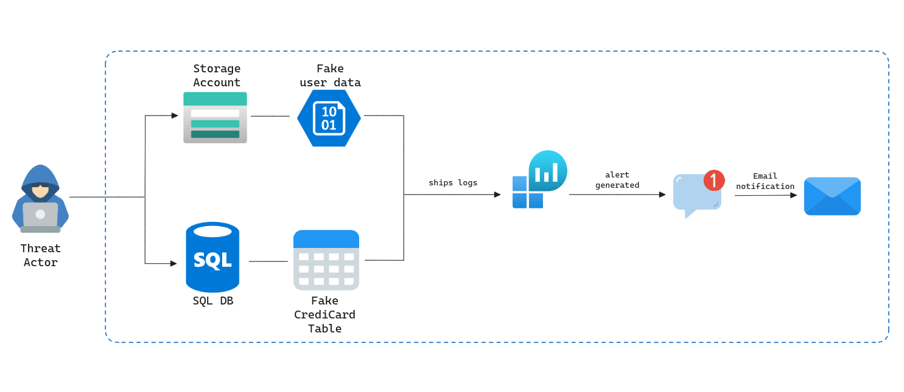

# HoneyZure


HoneyZure is a honeypot tool specifically designed for Azure environments, fully provisioned through Terraform. It leverages a Log Analytics Workspace to ingest logs from various Azure resources, generating alerts whenever the deceptive Azure resources are accessed.

## Acknowledgements

This project is strongly inspired by the work of [Adan Álvarez](https://github.com/adanalvarez), who created  [HoneyTrail](https://github.com/adanalvarez/HoneyTrail). His work motivated me to develop an Azure version, HoneyZure, to enhance my skills in both Azure and Terraform. Thanks to his patience in explaining the intricate workings of his amazing tools.

I also would like to express my sincere gratitude to [Arwin Lashawn](https://www.linkedin.com/in/arwinlashawn/) for his invaluable assistance with auditing Azure SQL Server and Database. His dedication and willingness to provide support late at night exemplify his commitment to helping the open source community. 

## How HoneyZure works

HoneyZure uses the following deception systems to detect internal compromises:

- **Blob Storage**: This storage contains a blob of fake user data.
- **Azure SQL Database**: This database contains a table called `CreditCardsData`.

After setting up these resources, Diagnostic Settings are enabled for both, allowing logs about read and write operations to be sent to a Log Analytics Workspace.

Alert rules are then generated using custom KQL queries to detect the name and other useful information about the user performing actions on these deception services.

When an alert is triggered, an email containing the output of the query is sent through an Action Group to an administrative user responsible for the security of the environment.

<p align="center">
  
</p>

## Configuration and Deployment

1. **Clone the Repository:** Begin by cloning the repository to your local machine or directly within the Azure CloudShell.

2. **Configure the Parameters:** Follow the provided instructions to configure the necessary parameters for your environment.

3. **Customize the Deception Services:** The primary objective of a honeypot is to lure attackers into accessing seemingly valuable resources. To enhance the effectiveness, consider renaming Resource Groups, blobs, and tables to appear more enticing to potential attackers.

4. **Initialize Terraform**: Run `terraform init` to initialize the Terraform configuration.

5. **Provision the infrastructure**: Run `terraform apply` to deploy the required resources.

Before the provisioning of HoneyZure, it is required to configure some parameters by editing the file `terraform.tfvars`:

```terraform
destination_email = "example@example.com"
sql_admin         = "tenant_admin@example.com"
enable_storage    = true
enable_sqldb      = true
```

To ensure proper functionality, HoneyZure requires configuration of the **destination_email** parameter to specify where alerts should be sent.

Additionally, to successfully deploy the Azure SQL Server and Database, you must specify a SQL server administrator using an active Microsoft Entra ID user in the **sql_admin** variable. While it is recommended to use the same user who deploys the tool, it is not mandatory.

Lastly, you can control the deployment of deception services by setting the values of **enable_storage** and **enable_sqldb** as needed.
